# Orchestration automatisée : ECS et Kubernetes

**Projet IPSSI - Mastère Cybersécurité - Amazon AWS : ECS & EKS**

**Binôme :** Holali David GAVI, Claire Danièle EBA

**Dépôt :** https://github.com/g-holali-david/automated-ecs-kubernetes-deployment

---

## 1. Cadrage

### 1.1 Le besoin

L'entreprise exploite une application conteneurisée sur deux plateformes. Amazon ECS sert la
production cloud, Kubernetes assure la portabilité vers des environnements hors AWS. La demande
n'est pas de choisir entre les deux mais d'industrialiser les deux déploiements avec une seule
chaîne d'automatisation.

Nous avons traduit ce besoin en quatre exigences :

| Exigence | Traduction technique |
|---|---|
| Charge | 2 tâches sur ECS, 3 réplicas sur Kubernetes avec montée automatique jusqu'à 8 |
| Disponibilité | Aucune coupure pendant une mise à jour, redémarrage automatique d'une instance en échec |
| Sécurité | Moindre privilège réseau, aucun secret dans le dépôt, images à tag figé |
| Coût | Fargate en 0,25 vCPU et 512 Mio, rétention des logs limitée à 7 jours |

### 1.2 L'application déployée

Nous réutilisons l'application développée pendant les TP précédents, une application Node.js
avec Express nommée Boutique IPSSI. Elle propose la création de compte, la connexion et un
gestionnaire de tâches persisté en PostgreSQL. Le projet ne demande pas le déploiement d'une base
de données. Nous l'avons fait uniquement pour aller plus loin dans l'apprentissage. L'application
affiche aussi le contexte d'exécution : le namespace, le nom du pod et le nœud qui répond.

Ce dernier point n'est pas cosmétique. Il permet de prouver visuellement sur quelle cible on se
trouve et, sur Kubernetes, de constater la répartition entre les réplicas en rechargeant la page.

L'application démarre même sans base de données. Ce choix est expliqué en section 3.3.

### 1.3 Contraintes d'environnement

AWS Academy impose la région `us-east-1`, interdit la création de rôles IAM et fournit des
identifiants de session temporaires. Le rôle `LabRole` est donc utilisé comme execution role des
tâches ECS. EKS étant indisponible pour la même raison, la cible Kubernetes est un cluster
Minikube local, nommé `projet-ipssi` pour être identifiable sur les captures. Les ressources
Kubernetes décrites restent transposables vers EKS sans modification.

---

## 2. Architecture

```
                      ┌──────────────┐
                      │     Git      │  code Terraform + Jenkinsfile
                      └──────┬───────┘
                             │ checkout
                      ┌──────▼───────┐
                      │   Jenkins    │  validate > plan > approbation > apply
                      └──────┬───────┘
                             │ pilote
                      ┌──────▼───────┐        ┌──────────────┐
                      │  Terraform   │───────►│  État sur S3 │
                      └───┬──────┬───┘        │  versionné   │
                provider  │      │  provider  │  chiffré     │
                   aws    │      │  kubernetes└──────────────┘
              ┌───────────▼┐    ┌▼─────────────┐
              │ Amazon ECS │    │  Kubernetes  │
              │  (Fargate) │    │  (Minikube)  │
              ├────────────┤    ├──────────────┤
              │ ECR        │    │ Namespace    │
              │ Cluster    │    │ ConfigMap    │
              │ TaskDef    │    │ Secret       │
              │ Service    │    │ Deployment   │
              │ ALB + SG   │    │ Service      │
              │ CloudWatch │    │ Ingress      │
              │            │    │ HPA + PVC    │
              │            │    │ Kyverno      │
              └────────────┘    └──────────────┘
```

Le point central de cette architecture est qu'il n'y a **qu'un seul état Terraform** pour les deux
cibles. Un `terraform apply` unique réconcilie ECS et Kubernetes. Le pipeline Jenkins produit un
plan couvrant les deux, le soumet à approbation, puis l'applique.

Le code est organisé en deux modules, `modules/ecs` et `modules/k8s`, appelés depuis un `main.tf`
racine. Les variables communes, dont le nom du projet et les noms du binôme, sont déclarées une
seule fois et transmises aux deux modules.

---

## 3. Partie 2 : déploiement sur ECS

### 3.1 Ressources créées

Le module `ecs` crée le dépôt ECR, le cluster Fargate, la task definition, le service, un
Application Load Balancer avec son target group et son listener, deux Security Groups et un
groupe de logs CloudWatch. Le VPC et les sous-réseaux par défaut sont récupérés par des data
sources, AWS Academy n'autorisant pas la création d'une infrastructure réseau complète.

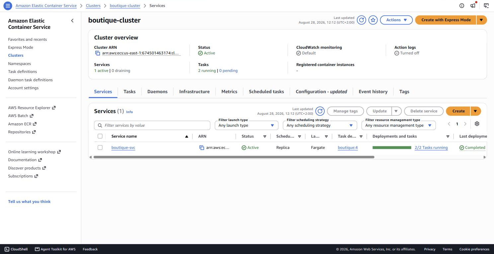

*Capture 02 : le service `boutique-svc` dans le cluster `boutique-cluster`, 2 tâches sur 2 en cours
d'exécution, dernier déploiement terminé.*

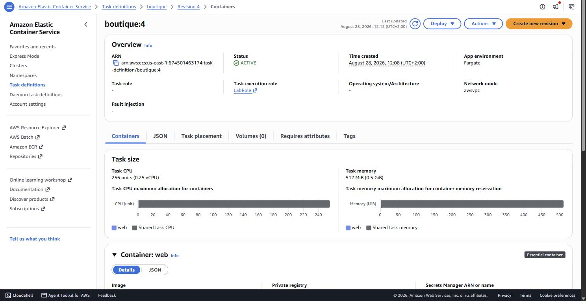

*Capture 03 : la task definition `boutique:4`. L'execution role est bien `LabRole`, le mode réseau
est `awsvpc` comme l'impose Fargate, et la taille est de 0,25 vCPU pour 512 Mio.*

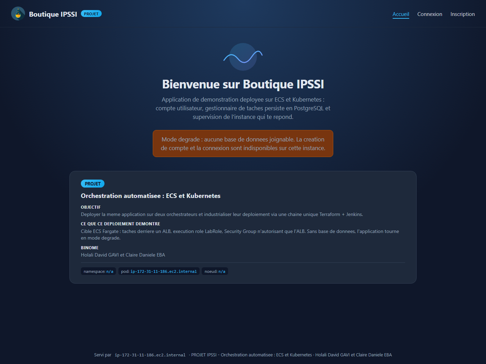

*Capture 01 : l'application répond sur l'URL publique de l'ALB.*

### 3.2 Exposition et mise à l'échelle

Le service est exposé par un ALB. Le target group est en mode `ip`, seule valeur possible avec le
mode réseau `awsvpc` de Fargate. Le nombre de tâches est piloté par la variable
`ecs_desired_count`, fixée à 2. Le scheduler ECS assure l'auto-réparation : si une tâche s'arrête,
il en relance une pour revenir au compte souhaité.

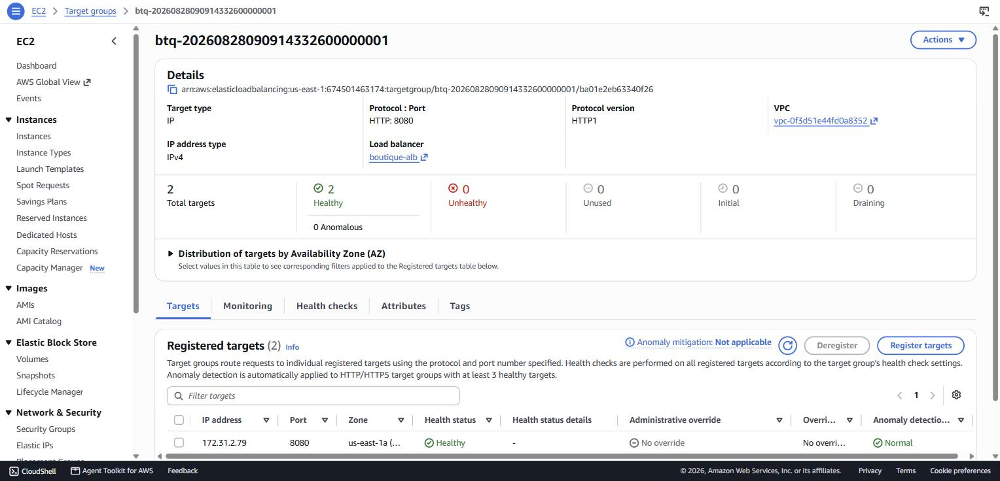

*Capture 04 : les 2 cibles enregistrées sont en `healthy`, sur le port 8080.*

Un détail a demandé une correction. Le target group porte un nom généré par `name_prefix` et non
un nom fixe, avec `create_before_destroy`. Sans cela, tout changement de port force le
remplacement du target group, et AWS refuse de supprimer l'ancien tant que le listener le
référence. Le déploiement se bloquait.

### 3.3 Absence de base de données sur ECS

Le projet ne demande pas le déploiement d'une base de données. Nous l'avons déployée uniquement sur
notre stack Kubernetes, parce que l'application que nous avons choisie le permet sans que ce soit
obligatoire.

Nous ne l'avons donc pas déployée sur ECS. RDS aurait dépassé le périmètre du projet, et un
conteneur PostgreSQL dans la même tâche aurait perdu ses données à chaque redémarrage, ce qui
n'aurait rien démontré.

Nous avons plutôt rendu la base optionnelle dans l'application. Sans base joignable, elle démarre
en mode dégradé : les pages restent servies, un bandeau signale l'indisponibilité, et la création
de compte est désactivée. Cela a une conséquence sur les sondes. La sonde de liveness interroge
`/health`, qui répond toujours 200 tant que le processus tourne. La sonde de readiness interroge
`/ready`, qui répond 503 sans base. Si la liveness avait dépendu de la base, une base absente
aurait fait redémarrer l'application en boucle alors qu'elle servait encore des pages.

La comparaison entre les captures 01 et 09 rend ce choix visible : même image, même page, le
bandeau dégradé d'un côté et le mode complet de l'autre.

---

## 4. Partie 3 : déploiement sur Kubernetes

### 4.1 Ressources créées

Le module `k8s` crée le namespace, une ConfigMap, un Secret, le Deployment de l'application, son
Service, l'Ingress, le HorizontalPodAutoscaler, la ClusterPolicy Kyverno, ainsi que le Deployment,
le Service et la PersistentVolumeClaim de PostgreSQL.

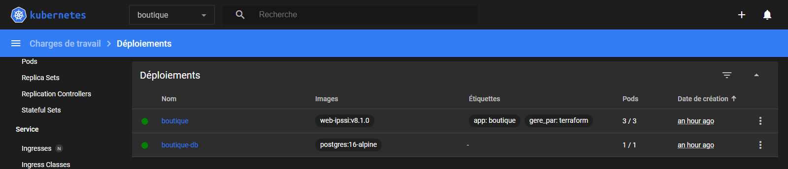

*Capture 10 : les deux Deployments du namespace, avec leurs images à tag explicite.*

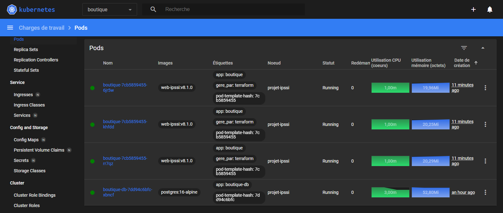

*Capture 11 : les quatre pods, tous en `Running` sur le nœud `projet-ipssi`, avec leur
consommation CPU et mémoire relevée par metrics-server.*

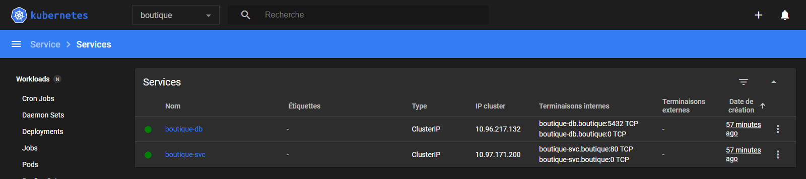

*Capture 12 : les Services, tous deux en `ClusterIP`. Aucun n'est exposé directement, l'entrée se
fait uniquement par l'Ingress.*

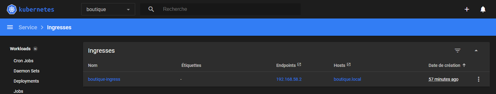

*Capture 13 : l'Ingress `boutique-ingress` sur l'hôte `boutique.local`.*

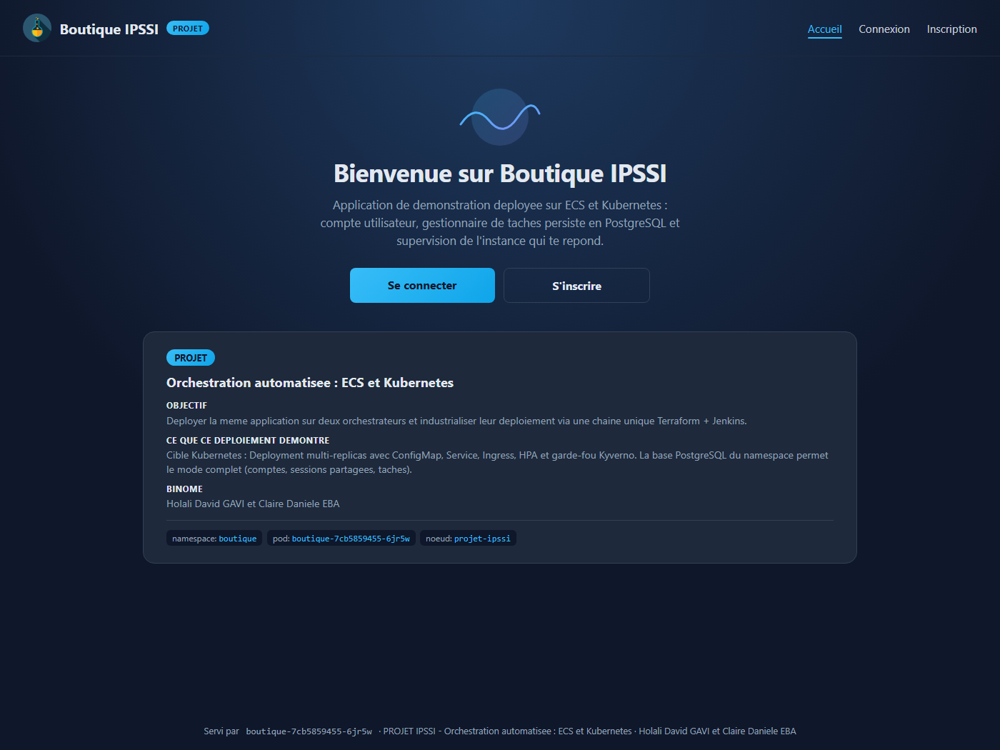

*Capture 09 : l'application servie par l'Ingress. Le namespace, le pod et le nœud sont renseignés,
contrairement à la capture 01 sur ECS.*

### 4.2 Configuration et secrets

La configuration non sensible passe par une ConfigMap injectée en variables d'environnement. Le
mot de passe PostgreSQL est généré par Terraform avec `random_password` et stocké dans un Secret.
Il n'apparaît nulle part dans le dépôt, ni dans la ConfigMap.

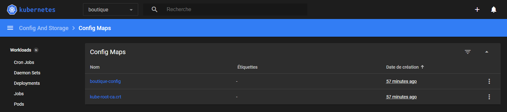

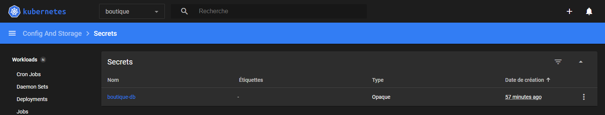

*Captures 14 et 15 : la ConfigMap et le Secret. Les coordonnées de la base sont dans la ConfigMap,
le mot de passe uniquement dans le Secret.*

Le pod reçoit aussi son propre nom, son namespace, son nœud et son adresse IP par l'API Downward.
Ce sont des informations que seul Kubernetes connaît au démarrage du conteneur.

### 4.3 Persistance

PostgreSQL monte une PersistentVolumeClaim de 1 Gio en `ReadWriteOnce`. Le volume est provisionné
dynamiquement par le storage-provisioner de Minikube.

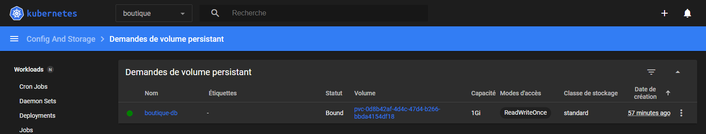

*Capture 16 : la PVC est en `Bound`, liée à un PersistentVolume créé automatiquement.*

Deux points ont demandé un ajustement. La stratégie de déploiement de PostgreSQL est en `Recreate`
et non en `RollingUpdate` : un volume `ReadWriteOnce` ne peut être monté que par un pod à la fois,
et un rolling update se serait bloqué. Par ailleurs, les données sont écrites dans un
sous-répertoire du point de montage, car celui-ci contient un dossier `lost+found` que
l'initialisation de PostgreSQL refuse.

### 4.4 Mise à l'échelle

Le HorizontalPodAutoscaler surveille la consommation CPU des pods et ajuste le nombre de réplicas
entre 3 et 8, avec une cible de 50 %.

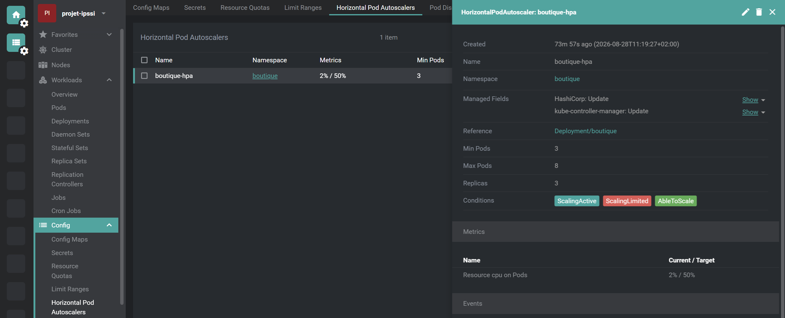

*Capture 18 : le HPA, ses seuils et ses conditions. `AbleToScale` et `ScalingActive` confirment
qu'il reçoit bien les métriques.*

Le calcul se fait par rapport aux `requests` déclarées dans le Deployment, ici 50 millicores. Sans
`requests`, le HPA n'a pas de base de calcul et reste inopérant. Nous avons aussi réduit la fenêtre
de stabilisation de descente de 300 à 30 secondes, pour rendre la redescente observable pendant une
démonstration.

### 4.5 Garde-fou de sécurité

Une ClusterPolicy Kyverno interdit le déploiement de tout pod dont l'image porte le tag `latest`
dans le namespace du projet, en mode `Enforce`.

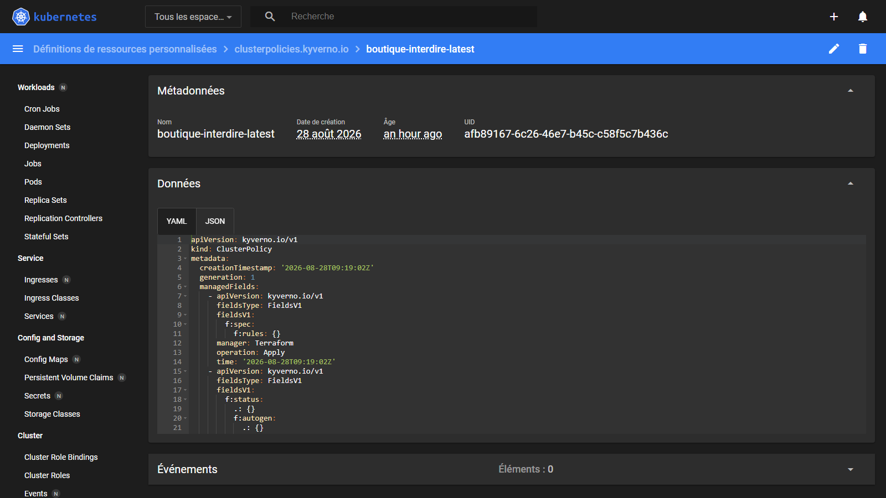

*Capture 19 : la ClusterPolicy `boutique-interdire-latest`. Le YAML indique `manager: Terraform`,
ce qui confirme qu'elle provient du code et non d'un `kubectl apply` manuel.*

Nous avons vérifié qu'elle bloque réellement :

```bash
kubectl run test-latest --image=nginx:latest -n boutique
```

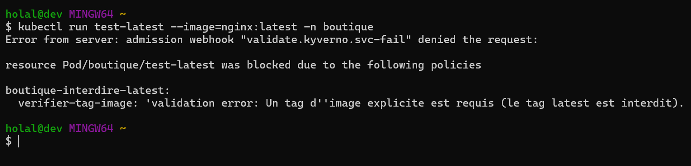

*Capture 20 : le webhook d'admission refuse la création. Le message affiché est celui que nous
avons écrit dans la règle, ce qui prouve que c'est bien notre politique qui agit. Le pod n'est pas
créé.*

---

## 5. Partie 4 : automatisation avec Jenkins

### 5.1 Le pipeline

Un `Jenkinsfile` unique, versionné dans le dépôt, pilote les deux cibles. Le job Jenkins est de
type Pipeline from SCM : il lit le Jenkinsfile depuis Git, ce qui garantit que le pipeline évolue
avec le code.

| Étape | Rôle |
|---|---|
| Checkout | récupère le code versionné |
| Init | `terraform init`, se connecte au backend S3 |
| Validate | `terraform fmt -check -recursive` puis `terraform validate` |
| Plan | un plan couvrant les deux cibles, archivé comme artefact |
| Approve | le pipeline s'arrête et attend une validation humaine |
| Apply | applique le plan validé |
| Verify | interroge ECS et Kubernetes en parallèle |


*Capture 21 : le pipeline complet.*

### 5.2 Idempotence

Le pipeline est rejouable. Sur une infrastructure déjà conforme, le plan annonce `No changes` et
l'apply se termine par `0 added, 0 changed, 0 destroyed`. Seules les différences sont appliquées.

C'est le backend S3 qui rend cela possible. Jenkins travaille dans un espace de travail vierge à
chaque exécution. Avec un état local, il n'aurait rien connu de l'existant et aurait tenté de
recréer les 26 ressources déjà déployées. En plaçant l'état sur S3, le poste de travail et Jenkins
partagent la même vision de l'infrastructure. Le bucket est versionné, chiffré en AES-256, et son
accès public est bloqué.

### 5.3 Approbation humaine

L'étape `Approve` est le point de gouvernance. Le plan est affiché et archivé avant que quiconque
puisse appliquer. Aucune modification d'infrastructure ne part sans relecture, ce qui est la
différence entre une automatisation et un automatisme.

---

## 6. Sécurité

**Moindre privilège réseau.** Deux Security Groups sont définis côté ECS. Celui de l'ALB accepte le
HTTP depuis Internet. Celui des tâches n'accepte que le port 8080 et uniquement depuis le Security
Group de l'ALB, jamais depuis Internet. Une tâche n'est donc joignable qu'à travers le
répartiteur de charge.

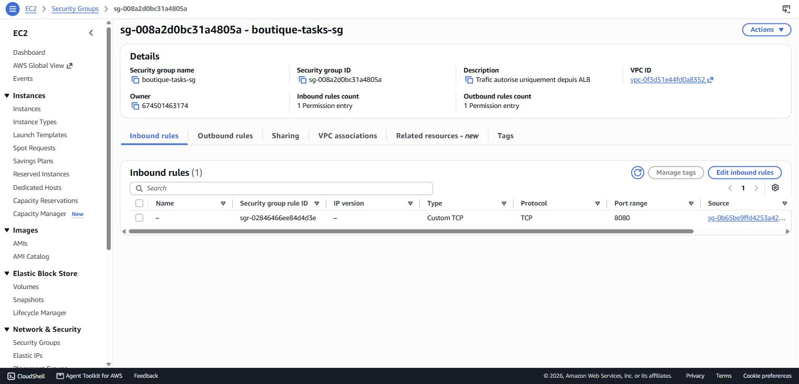

*Capture 05 : une seule règle entrante, dont la source est le Security Group de l'ALB.*

**Moindre privilège IAM.** L'execution role est `LabRole`, comme l'impose AWS Academy. Aucun rôle
n'est créé par le projet.

**Aucun secret en dur.** Les identifiants AWS sont temporaires et ne sont jamais versionnés. Le
fichier `terraform.tfvars` et l'état Terraform sont exclus par `.gitignore`, l'état contenant en
clair les valeurs des ressources. Le mot de passe PostgreSQL est généré par Terraform et vit dans
un Secret Kubernetes. Côté Jenkins, l'ARN du LabRole est fourni par une variable d'environnement
globale définie hors du dépôt, et les identifiants AWS sont recopiés vers le compte de service par
un script dédié.

**Images taguées.** Le tag `latest` n'est utilisé nulle part. Le dépôt ECR est en mode `IMMUTABLE`,
donc un tag publié ne peut plus être écrasé, avec analyse de vulnérabilités à chaque push. Côté
Kubernetes, la ClusterPolicy Kyverno refuse tout pod sans tag explicite.

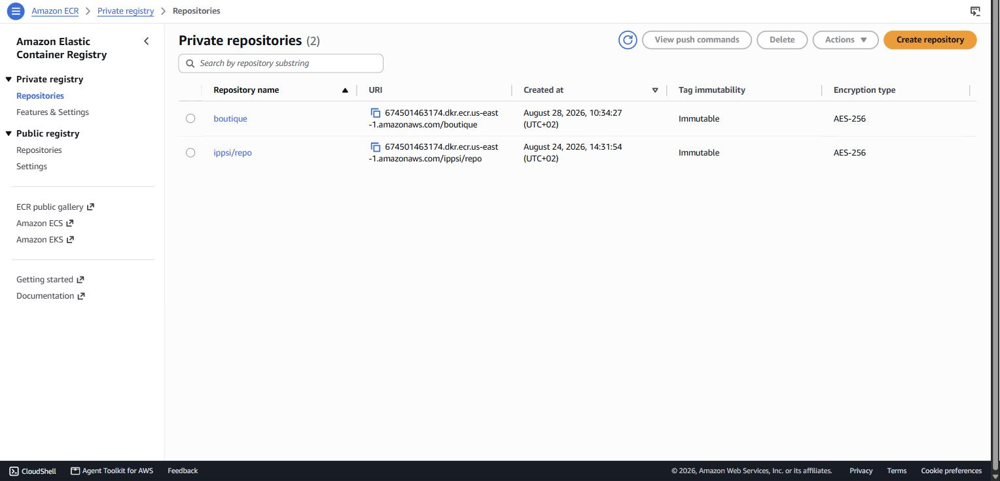

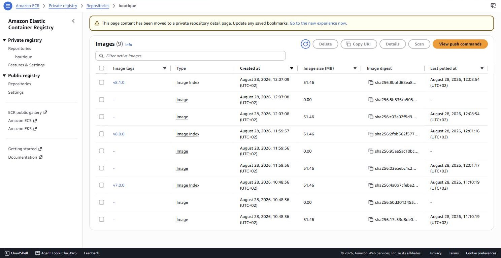

*Captures 06 et 07 : le dépôt est en mode immuable, et les trois versions successives coexistent
avec des empreintes distinctes. Aucune image n'a été écrasée d'un déploiement à l'autre.*

---

## 7. Résilience

| | ECS | Kubernetes |
|---|---|---|
| Instances | 2 tâches | 3 réplicas |
| Auto-réparation | scheduler ECS | ReplicaSet |
| Sondes | health check de l'ALB | readiness et liveness |
| Zéro coupure | `minimum_healthy_percent = 100` | `maxUnavailable: 0` et hook `preStop` |
| Retour arrière | deployment circuit breaker | `kubectl rollout undo` |
| Mise à l'échelle | `desired_count` | HPA sur le CPU, de 3 à 8 |

Sur ECS, le circuit breaker annule et restaure automatiquement un déploiement qui échoue. Avec
`minimum_healthy_percent` à 100 et `maximum_percent` à 200, une nouvelle tâche est démarrée et
déclarée saine avant qu'une ancienne soit retirée.

Nous l'avons observé lors du passage en version 8.1.0 : ECS a maintenu deux tâches en service
pendant toute la bascule, et l'ALB a répondu 200 sans interruption.

Sur Kubernetes, le même principe s'applique avec `maxUnavailable: 0` et `maxSurge: 1`. Un hook
`preStop` fait patienter le conteneur cinq secondes avant l'arrêt, le temps que le Service retire
le pod de ses endpoints, ce qui évite de perdre les requêtes en cours.

---

## 8. Reproductibilité

Les deux déploiements se recréent intégralement depuis le dépôt. Aucune étape manuelle n'est
laissée hors du code : le dépôt ECR, le cluster, le service, l'ALB, les Security Groups, le
namespace, la base et la politique de gouvernance sont tous décrits en Terraform.

Trois éléments seulement dépendent du poste et sont documentés dans le README : les identifiants
AWS de la session Academy, le nom du bucket d'état, et le chargement de l'image dans Minikube.
Ce dernier point vient d'une limite d'Academy : Minikube ne peut pas s'authentifier auprès d'ECR
sans imagePullSecret, l'image est donc chargée localement avec `minikube image load`.

Le projet se redéploie sur un compte AWS Academy différent sans modifier une ligne de code, en
surchargeant le bucket à l'initialisation et en renseignant les variables :

```bash
terraform init -reconfigure -backend-config="bucket=tfstate-ipssi-<ID_DU_COMPTE>"
```

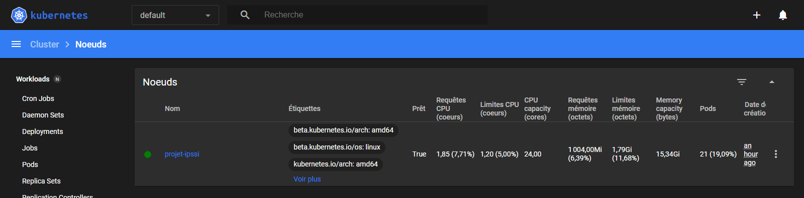

*Capture 17 : le nœud du cluster, nommé `projet-ipssi` pour être distingué des clusters des TP
précédents.*

---

## 9. Traçabilité

L'historique compte 20 commits aux messages explicites, décrivant chacun une modification
cohérente. Les corrections apportées en cours de projet sont visibles dans cet historique plutôt
que fondues dans un commit final.

Les journaux applicatifs de la cible ECS sont centralisés dans CloudWatch, avec une rétention de
sept jours.

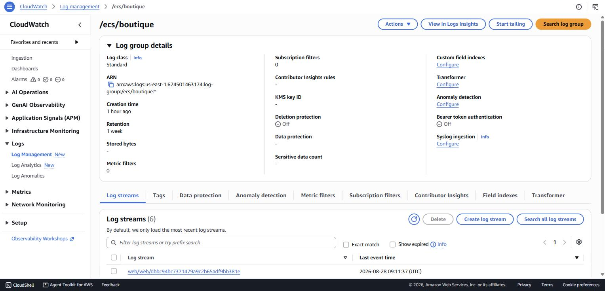

*Capture 08 : le groupe de logs `/ecs/boutique` et ses flux, un par tâche.*

Côté Terraform, l'état sur S3 est versionné : chaque apply crée une nouvelle version de l'état, ce
qui permet de revenir en arrière et de savoir quand une ressource a changé. Le plan de chaque
exécution Jenkins est archivé comme artefact du build, ce qui laisse une trace de ce qui a été
soumis à approbation.

---

## 10. Difficultés rencontrées

| Problème | Cause | Solution |
|---|---|---|
| Suppression du target group refusée | le listener le référence encore | `name_prefix` et `create_before_destroy` |
| `CrashLoopBackOff` au premier déploiement | port 80 déclaré au lieu de 8080 | correction dans les deux modules |
| PostgreSQL refuse de s'initialiser | `lost+found` dans le point de montage | données écrites dans un sous-répertoire |
| HPA sans effet | fenêtre de stabilisation par défaut trop longue | `select_policy` et fenêtre à 30 s |
| Jenkins voulait recréer les 26 ressources | espace de travail vierge, état local | backend S3 partagé |
| Vérification ECS en échec dans Jenkins | l'AWS CLI reprenait la région du poste | `AWS_DEFAULT_REGION` figée dans le Jenkinsfile |

La dernière mérite un mot. L'erreur mentionnait une ressource en `eu-west-3` alors que tout le
projet est en `us-east-1`. Le fichier de configuration de l'AWS CLI du poste portait encore cette
région d'un TP antérieur. Terraform n'était pas affecté car son provider fixe la région
explicitement, mais l'AWS CLI appelée dans l'étape de vérification, non. Figer la région dans le
Jenkinsfile règle le problème et rend le pipeline indépendant de la configuration de la machine.

---

## 11. Limites et pistes

La cible Kubernetes est un Minikube local. Les manifestes sont transposables vers EKS, mais
l'Ingress devrait y être remplacé par un contrôleur adossé à un load balancer AWS, et le stockage
par une StorageClass EBS.

La base de données n'est présente que sur la cible Kubernetes. Une architecture réelle utiliserait
un service managé partagé par les deux cibles.

Le pipeline s'arrête au déploiement de l'infrastructure. La construction et la publication de
l'image restent manuelles. Une étape supplémentaire pourrait les intégrer, avec un tag dérivé du
commit Git.

Enfin, les identifiants AWS sont recopiés vers le compte de service Jenkins par un script. Un
environnement de production utiliserait le gestionnaire d'identifiants de Jenkins ou un rôle IAM
porté par l'agent.

---

## 12. Répartition du binôme

Chacun a écrit sa part du code, puis déployé et exploité sa propre stack, sur son compte AWS
Academy et son cluster Minikube. Les deux membres savent expliquer l'ensemble de la chaîne.

| Tâche | Holali David GAVI | Claire Danièle EBA |
|---|---|---|
| Cadrage du besoin | Rédaction | Relecture |
| Schéma d'architecture | Relecture | Rédaction |
| Module Terraform `ecs` | Relecture | Rédaction |
| Module Terraform `k8s` | Rédaction | Relecture |
| Scripts d'exploitation AWS | | Rédaction |
| Scripts d'exploitation Kubernetes | Rédaction | |
| Pipeline Jenkins | Version écrite puis comparée | Version écrite puis comparée |
| Rapport écrit | Rédaction | Relecture |
| Déploiement et captures | Sa propre stack | Sa propre stack |
| Démonstration | Ses deux cibles | Ses deux cibles |

Chacun a écrit son propre `Jenkinsfile`. Nous les avons comparés, puis retenu une seule version
pour le dépôt commun, celle dont l'étape de vérification interrogeait les deux cibles en
parallèle. Les deux membres savent en dérouler chaque étape.

---

## 13. Bilan

Les quatre briques demandées sont en place. La même application tourne sur ECS Fargate et sur
Kubernetes, les deux déploiements sont décrits par un seul code Terraform en deux modules, et un
pipeline Jenkins gouverné les applique après approbation.

Ce que le projet nous a le plus appris n'est pas la syntaxe de Terraform mais la gestion de l'état.
Tant que l'état restait local, l'automatisation n'était qu'une apparence : le pipeline aurait
détruit et recréé une infrastructure existante. Le déplacer sur S3 a transformé le pipeline en
outil réellement idempotent, ce qui est la condition pour qu'une chaîne de déploiement soit
utilisable plus d'une fois.
